# 1. Creating an ssm document (CLI)

The AWS documentation for [Create an SSM document (command line)](https://docs.aws.amazon.com/systems-manager/latest/userguide/create-ssm-document-cli.html) shows the commands needed to creating ssm document from a custom yml document

To pass parameters in, we do that during the create automation stage after the document has already been created.

Commands for creating an ssm document

```bash
aws ssm create-document ^
    --content file://RHEL8_AMI.yml ^
    --name "RHEL8_AMI" ^
    --document-type "Automation" ^
    --document-format "YAML" ^
    --tags Key=Name,Value=RHEL8 Key=Environment,Value=Dev
```

Commands for updating an ssm document

```bash
aws ssm update-document ^
    --content file://RHEL8_AMI.yml ^
    --name "RHEL8_AMI" ^
    --document-version $LATEST ^
    --document-format "YAML"
```

Note: To specify a profile use

```bash
aws ssm create-document ^
    --profile "ssmtest" ^
    --region "ap-southeast-1" ^
    --content file://RHEL8_AMI.yml ^
    --name "RHEL8_AMI" ^
    --document-type "Automation" ^
    --document-format "YAML" ^
    --tags Key=Name,Value=RHEL8 Key=Environment,Value=Dev

aws ssm update-document ^
    --profile "ssmtest" ^
    --region "ap-southeast-1" ^
    --content file://RHEL8_AMI.yml ^
    --name "RHEL8_AMI" ^
    --document-version $LATEST ^
    --document-format "YAML"
```

# 2 SSM document

## 2.1 aws:runInstances

Documentation for [aws:runInstances – Launch an EC2 instance](https://docs.aws.amazon.com/systems-manager/latest/userguide/automation-action-runinstance.html) provides relevant examples

## 2.2 User data

The first user data script installs the ssm agent

- Installing the ssm agent requires the installation url to use the correct region
- Before conversion, set the user data script to the correct region

To convert the user data scripts to base 64, run `base64 -w0 <script_name>.sh`

Command to edit the parameter in the step directly (archive). We are taking the approach of adding it as the default value

```bash
sed -i "s/'{{ InstallSSMAgentUserData }}'/`base64 -w0 ssm_agent_install.sh`/g" RHEl8_AMI.yaml
```

## 2.3 Create image

Refer to [aws:createImage – Create an Amazon Machine Image](https://docs.aws.amazon.com/systems-manager/latest/userguide/automation-action-create.html) for documentation and code snippets

# 3. Console guide

## 3.1 Running an automation

After creating the document, click Automation on the left panel -> Execute automation

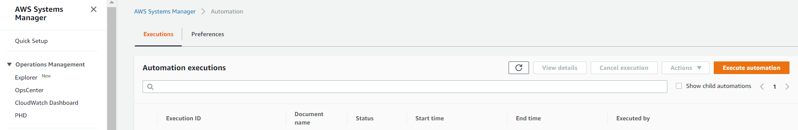

We then see the document and have an overview of the created document. Clicking Next reveals more details and allows us to execute the execution

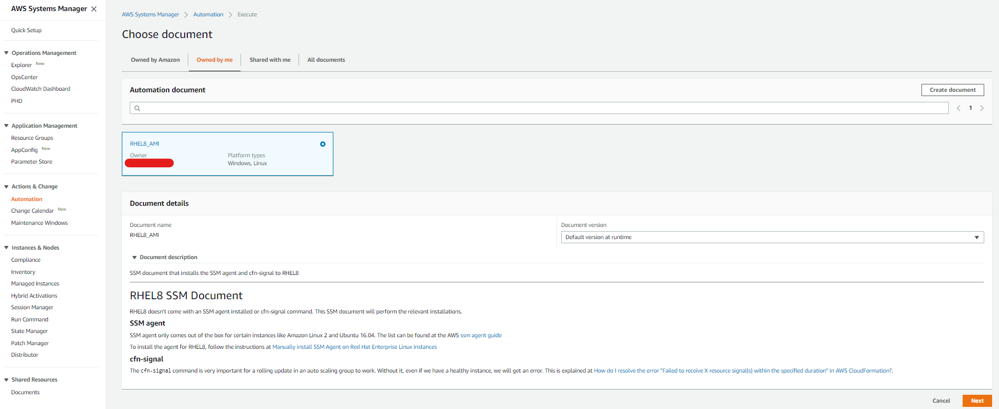

From the screen shown we can execute execution from the console or use a shareable link or get a command that we can execute from the CLI (change preference via the dropdown)

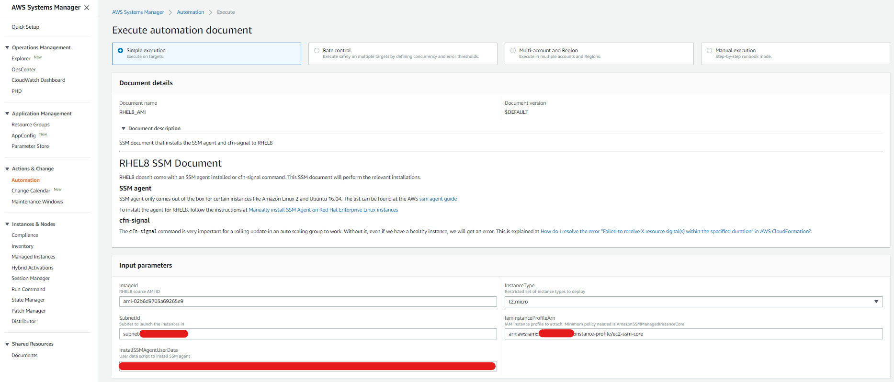

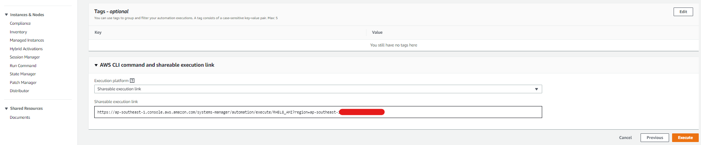

This shows up in the execution table

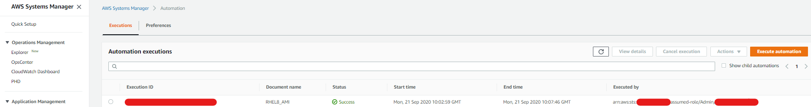


## 3.2 Patching and patch baselines

### 3.2.1 Predefined patch baselines

Systems Manager -> Patch Manager -> View predefined patch baselines

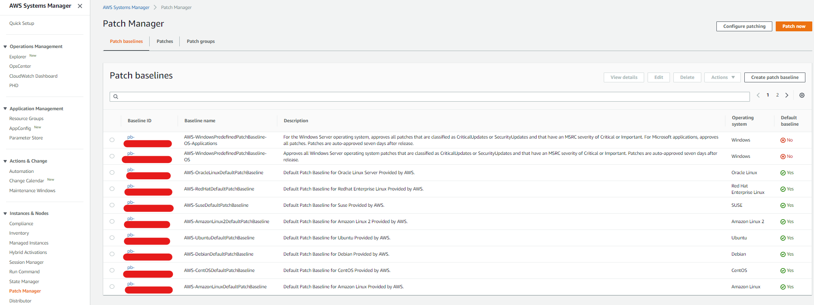

Example of the Red Hat Baseline

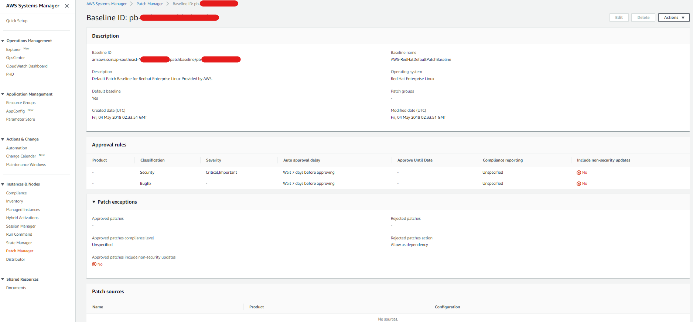

### 3.2.2 Creating a baseline

Systems Manager -> Patch Manager -> View predefined patch baselines -> Create patch baseline. Configure approval rules, patch exceptions, Patch Sources and tags

Set the Name and Operating System

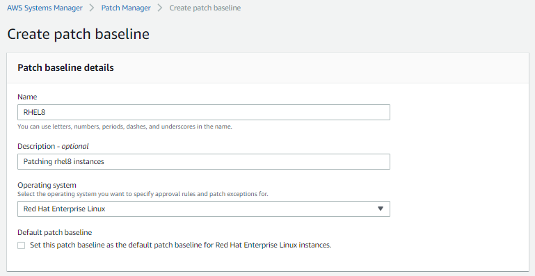

Set the approval rules (In this case I just set to all and auto approve immediately)

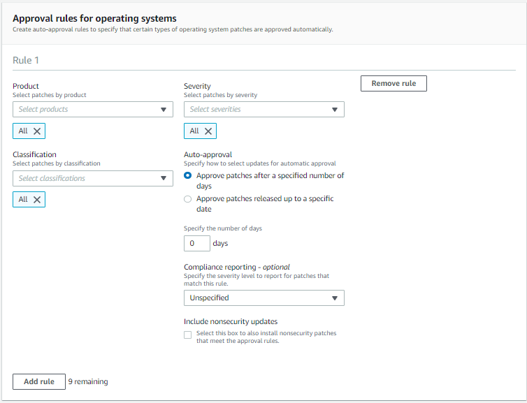

Then I leave the rest as defaults and Create patch baseline

### 3.2.3 Assign a patch group

Once the baseline has been created, Systems Manager -> Patch Manager -> View predefined patch baselines -> Search through the pages to find the patch. Check the patch baseline -> Actions -> Modify patch groups

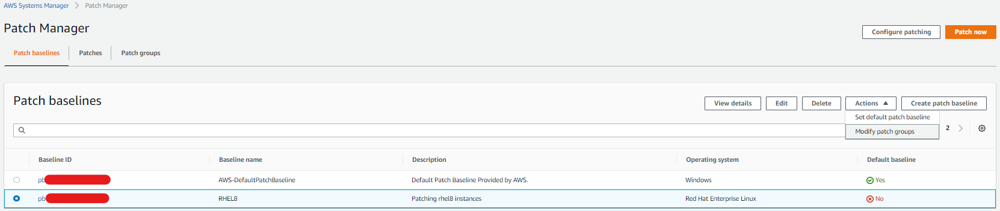

Give the patch group a name and click `Add`

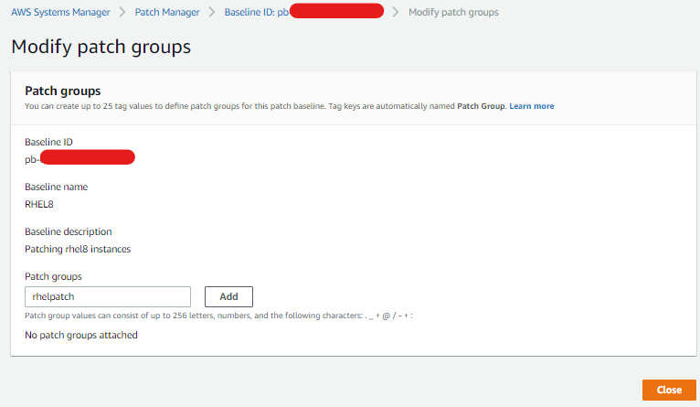

Head to the Patch Group tab to verify

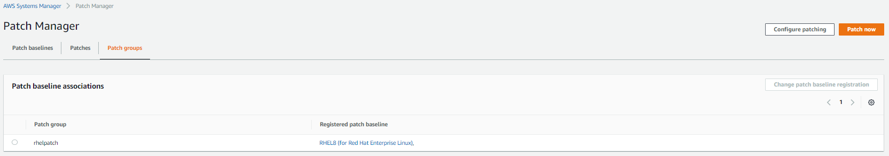

### 3.2.4 Configure patching

This is the step that  uses the patch baselines and patch groups created earlier

This AWS documentation, [About patch groups](https://docs.aws.amazon.com/systems-manager/latest/userguide/sysman-patch-patchgroups.html) explains how patch groups find the instances they are supposed to patch

- Note: In the 3.2.3 where we see the custom baseline, notice that it is not the default baseline for the Red Hat Enterprise Linux and this will influence how the baselines find the instances
- First check is for the appropriate tag. Since the custom patch group is called "rhelpatch", instances that are to be patched with the custom baseline need to be tagged with the key `Patch Group` and value `rhelpatch`
- If not, RHEL8 instances will default to the standard patch
- If there is a key `Patch Group` but its value doesn't match existing patch groups then it will still use the default baseline

There are 3 options for selecting instances

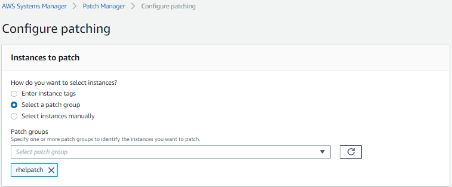

Configure the patching schedule (here I just scan now) and operation

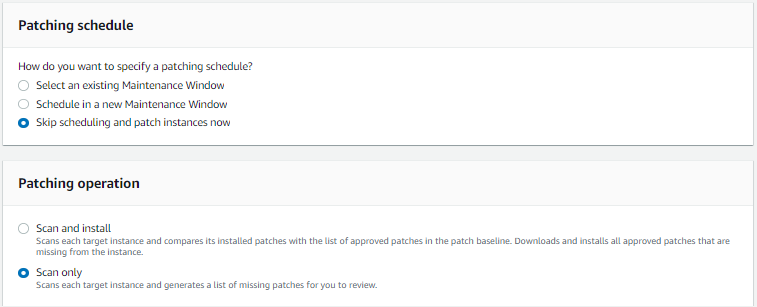

Under additional settings we see information that Patch Manager patches each instance using the registered patch baseline of its patch group.

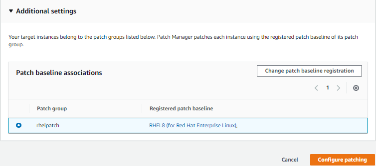

Verify that the command has been executed. Run command -> Command history

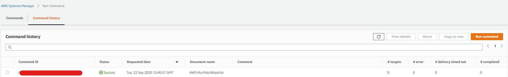

In this case since no instances have the correct tag to match the patch group specified, there are no instances to scan.

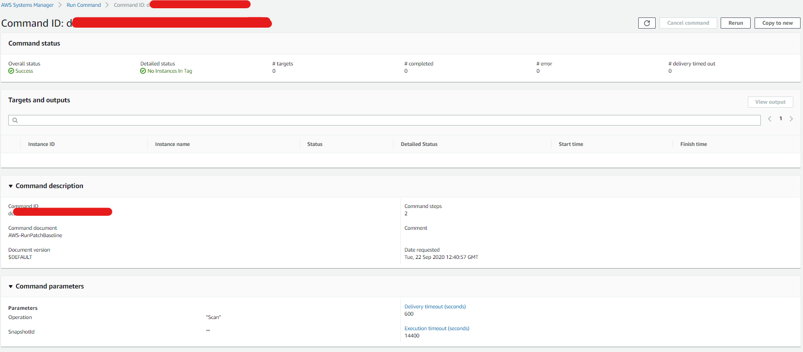

## 3.3 Maintenance window

Maintenance window -> Create maintenance window -> Steps are well guided. With the defaults, only Name, Duration and Stop initiating tasks are compulsory. The maintenance window shows up in the table after creation

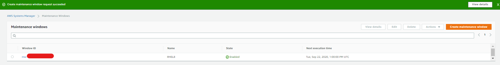

Clicking it shows the details configured earlier

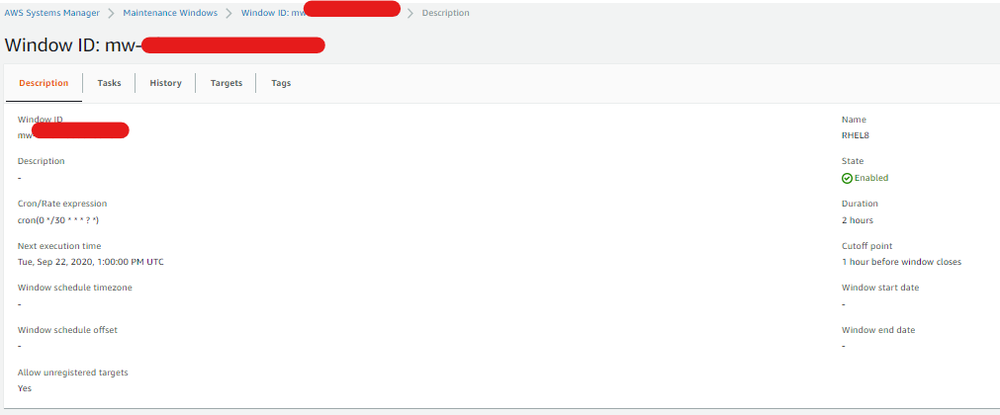

Register tasks

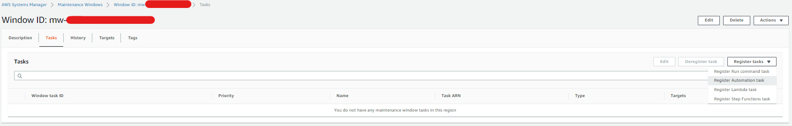

Accept the defaults and select the automation document. Select the targets, configure concurrency and error threshold

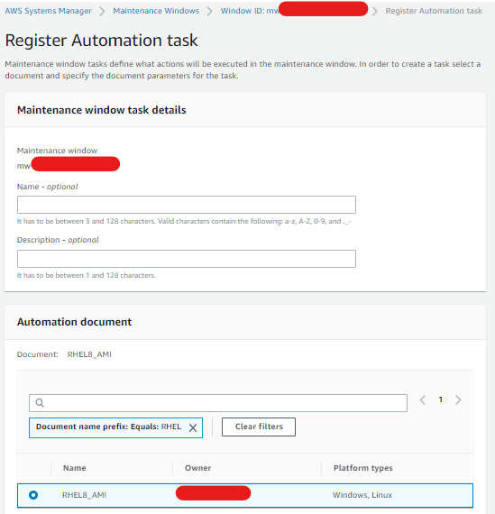

# 4. ARNs and IAM

[Actions, resources, and condition keys for AWS Systems Manager](https://docs.aws.amazon.com/IAM/latest/UserGuide/list_awssystemsmanager.html) shows a list of ARNs and the way to use resource tags to control access

A sample of using resource tags is in the snippet below. Here I ban getting any parameter that starts with prod if there isn't a tag which says read: yes

```json
{
    "Effect": "Deny",
    "Action": [
        "ssm:GetParameter*"
    ],
    "Resource": [
        "arn:aws:ssm:*:*:parameter/prod*"
    ],
    "Condition": {
        "StringNotEqualsIgnoreCaseIfExists": {
            "ssm:resourceTag/read": "yes"
        }
    }
}
```

# 5. Useful Installs

## 5.1 Utility installs

```bash
yum install vim -y
yum install unzip -y
```

## 5.2 Install AWS CLI

By default, installing this will install this to `/usr/local/bin/aws`

- Can run in normal user with `aws`
- Can run in root with `/usr/local/bin/aws`

```bash
curl "https://awscli.amazonaws.com/awscli-exe-linux-x86_64.zip" -o "awscliv2.zip"
unzip awscliv2.zip
chmod -R +x aws
sudo ./aws/install
```

Setting the `aws` command to be able to run in root

```bash
alias aws="/usr/local/bin/aws"
source ~/.bash_profile
```

## 5.3 Install git

```bash
sudo dnf install git -y
```

## 5.4 Install python

```bash
sudo yum install python3 -y
```

## 5.5 Install docker

```bash
sudo su
# Enable Docker CE package repository
dnf config-manager --add-repo=https://download.docker.com/linux/centos/docker-ce.repo
# Check available docker version
dnf list docker-ce
# Install the latest version of docker
dnf install docker-ce --nobest -y
# start and enable docker's service
systemctl start docker
systemctl enable docker
```

## 5.6 Install kubectl on Rhel

[Install kubectl on Linux](https://kubernetes.io/docs/tasks/tools/install-kubectl/)

```bash
cat <<EOF > /etc/yum.repos.d/kubernetes.repo
[kubernetes]
name=Kubernetes
baseurl=https://packages.cloud.google.com/yum/repos/kubernetes-el7-x86_64
enabled=1
gpgcheck=1
repo_gpgcheck=1
gpgkey=https://packages.cloud.google.com/yum/doc/yum-key.gpg https://packages.cloud.google.com/yum/doc/rpm-package-key.gpg
EOF
yum install -y kubectl
```

## 5.7 Install helm

[Installing Helm](https://helm.sh/docs/intro/install/)

```bash
curl -fsSL -o get_helm.sh https://raw.githubusercontent.com/helm/helm/master/scripts/get-helm-3
chmod 700 get_helm.sh
./get_helm.sh
```


